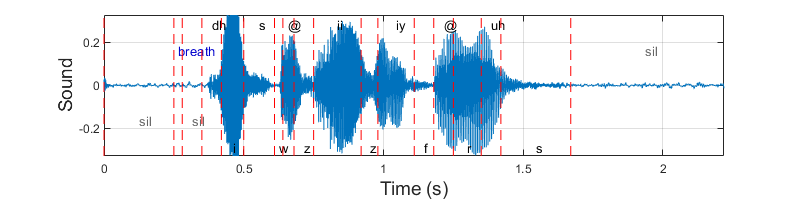
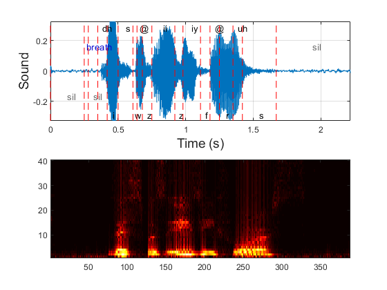
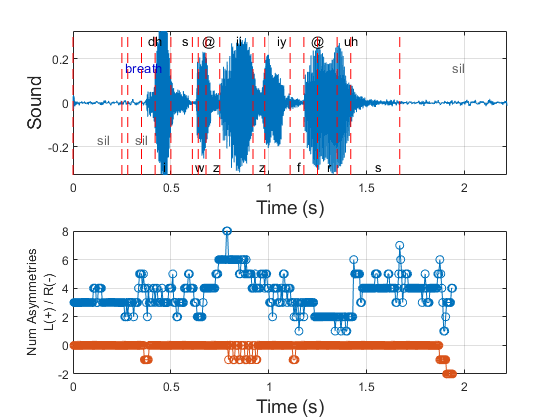
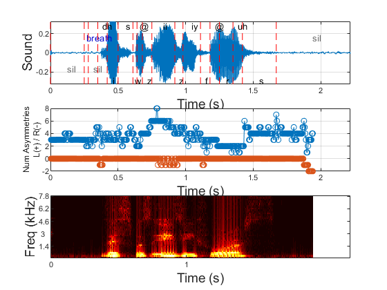
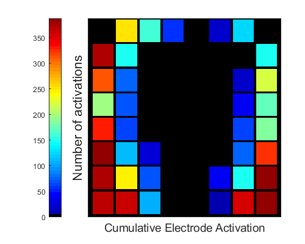

# ElectroPalatography
A repository of useful routines that can be used in Phonetics and Electropalatography

##### Table of Contents  

[Convert LAB format to TextGrid Format](#LabTextGrid)  
[Convert LAB or TextGrid to a MATLAB Cell](#LABTextGridCell)   
[Read the audio file](#readAudioFile)   
[Read the ElectroPalatography data](#readPalatogram)   
[Short-Time Fourier Analysis](#STFA)   
[Visualisation](#Visualisation)   
[Display audio signal with Phonemes](#displaySoundWave)   
[Display of the asymmetry index](#displayAsymmetryIndex)   
[Display of the Spectrogram](#Spectrogram)   
[Display of the Palatogram](#Palatogram)   

<a name="LabTextGrid"/>
<h2>Convert LAB format to TextGrid Format</h2>
</a>

In experiments of phonetics, there are different formats in which the phonemes can be segmented. This is typically done on a small phrase such as "the chalk, the soup, the sugar". There are different formats in which these are recorded, one of them is a file with extension .lab (for labels) which has a simple format with start time-stop time-phoneme:

<pre class="codeinput">
0 0.25 sil
0.25 0.28 breath
0.28 0.35 sil
0.35 0.42 dh
0.42 0.5 i
</pre>

See for instance the data base of MOCHA TIMIT (<a href="http://www.cstr.ed.ac.uk/research/projects/artic/mocha.html">http://www.cstr.ed.ac.uk/research/projects/artic/mocha.html</a>)

Another format is TextGrid, use by the popular software Praat (www.fon.hum.uva.nl/praat/). These files with extension .TextGrid have a more complicated format that allows to have words and phonemes. A file can look like this:

<pre class="codeinput">
File type = "ooTextFile"
Object class = "TextGrid"

xmin = 0
xmax = 3.968
tiers? exists
size = 1 item []:
     item [1]:
              class = "IntervalTier"
              name = "phonemes"
              xmin = 0         
              xmax = 3.968         
              intervals: size = 51         
              intervals [1]:             
                   xmin = 0             
                   xmax = 0.7904913168586506             
                   text = ""         
                   intervals [2]:             
                   xmin = 0.7904913168586506             
                   xmax = 0.8708421929714597             
                   text = "g"
</pre>

To convert from lab to textgrid you can use the following function:

<pre class="codeinput">
TextGrid = Lab_to_TextGrid(dataIn);
</pre>

dataIn can be two different options:

1) a single file name, the file will be read and converted to TextGrid and saved in the same folder where the .lab file is located

2) a folder, all the .lab files in the folder will be converted to TextGrid

 The code requires one intermediate function to convert the lab file to a MATLAB Cell, this can be used separately to process phonemes in MATLAB. There is a parallel function to read TextGrid and convert to a MATLAB Cell.

<a name="LABTextGridCell"/>
<h2>Convert LAB or TextGrid to a MATLAB Cell </h2>
</a>

 The function interpretLabelledPhonemes takes a file name as input and converts the phonemes, and words if available in TextGrid, to a MATLAB Cell. The function automatically detects the name of the file (it can end in "d" for TextGrid or "b" for lab), and calls the correct function, either convert_LAB_to_Phonemes.m or convert_TextGrid_to_Phonemes.

<pre class="codeinput">
[EPG_parameters] = interpretLabelledPhonemes(currentLAB_File,EPG_parameters);
</pre>

 For example:

<pre class="codeinput">

>> currentLAB_File = 'MOCHA/fsew0_v1.1/fsew0_001.lab';
>> [EPG_parameters] = interpretLabelledPhonemes(currentLAB_File);
>> disp(EPG_parameters)
            LAB: {18×3 cell}
    numPhonemes: 18
          Words: []
       numWords: 0

>> disp(EPG_parameters.LAB)
    [     0]    [0.2500]    'sil'   
    [0.2500]    [0.2800]    'breath'
    [0.2800]    [0.3500]    'sil'   
    [0.3500]    [0.4200]    'dh'    
    [0.4200]    [0.5000]    'i'     
    [0.5000]    [0.6100]    's'     
    [0.6100]    [0.6400]    'w'     
    [0.6400]    [0.6800]    '@'     
    [0.6800]    [0.7500]    'z'     
    [0.7500]    [0.9200]    'ii'    
    [0.9200]    [0.9800]    'z'     
    [0.9800]    [1.1100]    'iy'    
    [1.1100]    [1.1800]    'f'     
    [1.1800]    [1.2500]    '@'     
    [1.2500]    [1.3500]    'r'     
    [1.3500]    [1.4200]    'uh'    
    [1.4200]    [1.6700]    's'     
    [1.6700]    [2.2000]    'sil'  
</pre>

<a name="readAudioFile"/>
<h2>Read the audio file </h2>
</a>

The files for electropalatography are saved separately into several files:

* .wav contains the audio file as a wave, in most cases the sample rate is also available from the same file

* .epg contains the electropalatography data, contacts with the electrodes of a palate

* .lab contains the labelled phonemes

* .TextGrid same as the  .lab, but with the format of PRAAT

 To read the audio file and automatically calculate some important parameters use the file readAudioFile like this:

<pre class="codeinput">
>> currentWAV_File = 'MOCHA/fsew0_v1.1/fsew0_001.wav';
>> [EPG_parameters]   = readAudioFile (currentLAB_File);
>> disp(EPG_parameters)
     audioWave: [35495×1 double]
    sampleRate: 16000
    numSamples: 35495
    timeVector: [1×35495 double]
     totalTime: 2.2184
     maxSignal: 0.4084
     minSignal: -0.4106

>> sound(EPG_parameters.audioWave,EPG_parameters.sampleRate)
</pre>

The last line will reproduce the sound.

<a name="readPalatogram"/>
<h2>Read the ElectroPalatography data  </h2>
</a>

The process of reading the ElectroPalatography data from an EPG file requires several files, readPalatogram.m, EPG_to_Palatogram.m, assymetry_projection.m and EPB_Boxes.mat. These are necessary as many things are calculated in this step. Among them the whole time frame of the palatograms and their asymmetry calculation, the asymmetry index (i.e. how asymmetric is every EPG recorded). It is recommended to read the audio file previously as the sample rate is necessary for some calculations.

<pre class="codeinput">
>> currentLAB_File = 'MOCHA/fsew0_v1.1/fsew0_001.wav';
>> currentEPG_File = 'MOCHA/fsew0_v1.1/fsew0_001.epg';
>> [EPG_parameters]   = readAudioFile (currentLAB_File);
>> EPG_parameters = readPalatogram(currentEPG_File,EPG_parameters);
>> disp(EPG_parameters)
                  audioWave: [35495×1 double]
                 sampleRate: 16000
                 numSamples: 35495
                 timeVector: [1×35495 double]
                  totalTime: 2.2184
                  maxSignal: 0.4084
                  minSignal: -0.4106
                  FrameRate: 200
                  numImages: 388
                       rows: 300
                       cols: 240
                       levs: 1
              EPGtimeVector: [1×388 double]
               EPGtotalTime: 1.9400
                   stepSamp: 80
                current_EPG: 'MOCHA/fsew0_v1.1/fsew0_001.epg'
                          v: []
                  asymIndex: [388×3 double]
                 Palatogram: [300×240×1×388 double]
             PalatogramAsym: [300×240×3×388 double]
        activeElectrodesCum: [300×240 double]
    asymmetricElectrodesCum: [300×240 double]

>>
</pre>

<a name="STFA"/>
<h2>Short-Time Fourier Analysis  </h2>
</a>

To calculate the Short-Time Fourier Transform of the audio signal, together with a series of parameters, the function shortTimeFourierAnalysis is used in the following way:

<pre class="codeinput">

>> EPG_parameters=shortTimeFourierAnalysis(EPG_parameters);
>> disp(EPG_parameters)
                  audioWave: [35495×1 double]
                 sampleRate: 16000
                 numSamples: 35495
                 timeVector: [1×35495 double]
                  totalTime: 2.2184
                  maxSignal: 0.4084
                  minSignal: -0.4106
                  FrameRate: 200
                  numImages: 388
                       rows: 300
                       cols: 240
                       levs: 1
              EPGtimeVector: [1×388 double]
               EPGtotalTime: 1.9400
                   stepSamp: 80
                current_EPG: 'MOCHA/fsew0_v1.1/fsew0_001.epg'
                          v: []
                  asymIndex: [388×3 double]
                 Palatogram: [300×240×1×388 double]
             PalatogramAsym: [300×240×3×388 double]
        activeElectrodesCum: [300×240 double]
    asymmetricElectrodesCum: [300×240 double]
               lengthWindow: 0.0050
        timeTickVectorSound: [0 16000 32000]
       timeTickVectorSoundL: [0 1 2]
      timeTickVectorWindowL: [0 1 2 3 4 5]
       timeTickVectorWindow: [1 16.8000 32.6000 48.4000 64.2000 80]
     timeTickVectorSpectrum: [1 201]
    timeTickVectorSpectrumL: [0 1]
             freqTickVector: [8 16 24 32 40]
            freqTickVectorL: [1400 3000 4600 6200 7800]
                   maxSound: 0.3267
                   minSound: -0.3284
                maxSpectrum: 1.7651
                minSpectrum: 1.4185e-05
                  tempSound: [80×388 double]
               tempSpectrum: [40×388 double]
             tempTimeVector: [80×388 double]

>>

</pre>

 As you can see, all the parameters are saved in a single variable; EPG_parameters.

<a name="Visualisation"/>
<h1> Visualisation </h1>
</a>

The variable EPG_parameters contains all that is required to perform a series of calculations and visualisations of the sound. The variables can be accessed directly, for instance:

 The audio signal:

<pre class="codeinput">
plot(EPG_parameters.audioWave)
</pre>

<pre class="codeinput">
imagesc(EPG_parameters.PalatogramAsym(:,:,:,1))
</pre>

The Asymmetry index along time:

A montage of the first 130 palatograms:
<pre class="codeinput">
montage(EPG_parameters.PalatogramAsym(:,:,:,1:130))
</pre>

Spectrogram of the audio signal:
<pre class="codeinput">
imagesc(EPG_parameters.tempSpectrum);axis xy;colormap hot
</pre>

Notice that the Spectrogram is not callibrated.

However, there are several specialised tools in this repository, which are described below.

<a name="displaySoundWave"/>
<h3> Display audio signal with Phonemes </h3>
</a>

 The function displaySoundWave.m will display the audio signal and will embed the
phonemes.

<pre class="codeinput">
displaySoundWave(EPG_parameters);
</pre>

The display of the phonemes requires an extra function called addPhonemes, which draws vertical lines at the beginning of each phoneme and then the phoneme as listed in
either the lab or TextGrid file. Silence and breath are displayed in gray and blue, whilst
the phonemes themselves are displayed in black, and are positioned alternating positions
up and down for clarity as they sometimes overlap.

Alternatively, if you want to create a figure with several plots in it,
you can select the subplots and pass the handles as an input argument.
For example:

<pre class="codeinput">

figure
h1 = subplot(211);
h2 = subplot(212);
imagesc(EPG_parameters.tempSpectrum);axis xy;colormap hot
displaySoundWave(EPG_parameters,h1);
</pre>

The use of the handles will become more clear with subsequent examples.

<a name="displayAsymmetryIndex"/>
<h3> Display of the asymmetry index </h3>
</a>

The asymmetry index contains the number of activations that happen on one side of the palate independent of the other side. To display the asymmetry index, use the function displayAsymmetryIndex. This can be combined with the sound wave in the following way:

<pre class="codeinput">
figure
h1 = subplot(211);
displaySoundWave(EPG_parameters,h1);
h2 = subplot(212);
displayAsymmetryIndex(EPG_parameters,h2);
</pre>

Notice that the asymmetry index finishes some time before the sound wave, this is due to the time the palatograms are recorded and these can be stopped some time before the sound wave finishes.

<a name="Spectrogram"/>
<h3> Display of the Spectrogram </h3>
</a>

The Spectrogram contains the frequency of short-time windows. This corresponds to the Fourier Transform of the signal for the window. Other ways to display the Fourier signal will be added below. The function to display the Spectrogram is displaySpectrogram. This can be combined as before:

<pre class="codeinput">
figure
h1 = subplot(311);
displaySoundWave(EPG_parameters,h1);
h2 = subplot(312);
displayAsymmetryIndex(EPG_parameters,h2);
h3 = subplot(313);
displaySpectrogram(EPG_parameters,h3);
</pre>

Again notice that Spectrogram finishes some time before the sound wave. This is done to be able to correlate the spectra with the palatograms.

<a name="Palatogram"/>
<h2>Display of the Palatogram</h2>
</a>

To visualise the palatograms, there are several options. If you are interested in a particular time point, you can pass the number as a second input argument to the function displayPalatogram:

<pre class="codeinput">
displayPalatogram(EPG_parameters,1);
</pre>

Again, it is possible to have several plots in a single figure using handles:

<pre class="codeinput">
figure
h1 = subplot(131);
h2 = subplot(132);
h3 = subplot(133);
displayPalatogram(EPG_parameters,1,h1);
displayPalatogram(EPG_parameters,20,h2);
displayPalatogram(EPG_parameters,388,h3);
</pre>

The activation is colour coded: white is used when electrodes on both sides are activated simultaneously. When only one side is activated, the electrode is displayed on cyan or magenta.

To visualise the cumulative activation over all time points, there are two options. First, is the accumulation of all activations:

<pre class="codeinput">
displayPalatogram(EPG_parameters,-1);
</pre>

Second, is the accumulation of only the asymmetric activations, that is, the symmetric cases are discarded:

<pre class="codeinput">
displayPalatogram(EPG_parameters,-2);
</pre>

Finally, to visualise all activations sequentially, use the second argument with value -3:

<pre class="codeinput">
displayPalatogram(EPG_parameters,-3);
</pre>

 <a href="https://www.mathworks.com/products/matlab/">Published with MATLAB&reg; R2018a</a> 

