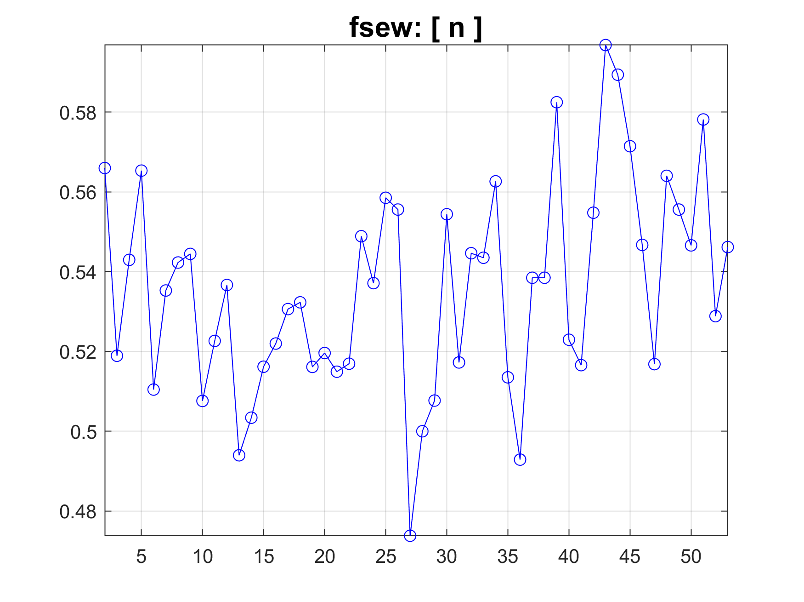

# Compare Phonemes

Comparison of the Palatograms of different Phonemes  in a series of phrases.


<h2>Reference</h2>

If you find these routines useful, please cite as:

<h3>
Verhoeven, J., Miller, N. R.,  & Reyes-Aldasoro, C. C. (2018). Analysis of the symmetry of electrodes for Electropalatography with Cone Beam CT Scanning. In Medical Image Understanding and Analysis, Southampton, UK, 09-11 July 2018.
</h3>


<a name="LabTextGrid"/>
<h2>Description of ComparePhonemes.m</h2>
</a>

<p>This file takes as input a folder where there are a number of phrases and calculates the palatograms
     for each occurrence.
</p>


<h3> Select the speaker </h3>
<p> In our example there are 2 cases, msak and fsew, this will select the folder where
 each is stored
</p>
<pre class="codeinput">
 speaker     = 'msak';
%speaker     = 'fsew';
</pre>
<br/>


<h3>Select the base folder where the files (a number of files) is stored</h3>
<pre class="codeinput">
if strcmp(filesep,'\')
    baseDir     = strcat('D:\OneDrive - City, University of London\Acad\City_Research\JoVerhoeven\MOCHA_Relabelled\',speaker,'0_v1.1',filesep);
else
    baseDir     = strcat('/Users/ccr22/OneDrive - City, University of London/Acad/Research/JoVerhoeven/MOCHA_Relabelled/',speaker,'0_v1.1',filesep);
end
</pre>


<br/>


<h3>  </h3>
<p> Read the folder and determine the number of phrases (i.e. files)
</p>

```
dir0        = dir(strcat(baseDir, '*.mat'));
numPhrases  = size(dir0,1);
```

<br/>


<h3>Define phonemes of interest in a list</h3>
<p> This is a list of the phonemes of interest, more or less can be defined by changing
% this line
</p>
<pre class="codeinput">
 listPhonemes    = {'n','d','t','r','ng','g','k','w','z','s','zh','sh','l','jh','ch'};
numPhonemes     = size(listPhonemes,2);


</pre>
<br/>


<h3>Initialise the cell where results will be stored </h3>
<p>  All results will be stored in a cell, phoneme names on the first column, the
 palatograms for each phoneme per occurrence in the second, then the measurements of
 asymmetry in the columns 3-8. Notice that the size of the palatograms will be
 different depending on how many times and how long each time occurs.

</p>
<pre class="codeinput">
avPhoneme_tot{numPhonemes,8}=[];
for count_phoneme = 1:numPhonemes
    avPhoneme_tot{count_phoneme,1} = listPhonemes{count_phoneme};
end
</pre>
<br/>


<h3>Calculate all the occurrences per phrase / per phoneme</h3>
<p>
</p>
<pre class="codeinput">
 for k=1:numPhrases
    % iterate over the phrases, it is assumed that the files were previously
    % calculated and save as MATLAB, but these can also be calculated from .wav,
    % .epg, .TextGrid/lab
    disp(dir0(k).name)
    load(strcat(baseDir,dir0(k).name));
    for count_phoneme = 1:size(listPhonemes,2)
        % Iterate now over the phonemes, this is very quick as the slow part is the
        % calculation of EPG_parameters
        avPhoneme_tot{count_phoneme,2} = extract_Phoneme_EPG(EPG_parameters,listPhonemes{count_phoneme},avPhoneme_tot{count_phoneme,2});
    end
end
</pre>


<h3> Calculate asymmetries </h3>
<p>
There are many ways to calculate asymmetry:

</p>
<p>
a) calculating  the
 occurrences  of  the  left/right  sides  of  the  palatogram  and
 dividing  by  the total number of occurrences.  Thus a perfectly
 symmetrical case would have a result 0.5/0.5 whilst a perfectly
 asymmetrical  case  would  be  either  1/0  or  0/1. These values are
 stored in columns 3 and 4 of avPhoneme_tot.

 </p>
 <p>
 b) calculating  the
 occurrences  of  the  left/right  sides  of  the  palatogram  and then  
 calculating (number of right - number of left) / (number of right - number of left)
 Thus a perfectly  symmetrical case would have a result 0 whilst a perfectly
 asymmetrical  case  would  be  either  +1  or  -1.  This values, per phoneme occurrence are stored in column 9 of avPhoneme_tot.

</p>


<pre class="codeinput">
for k = 1:numPhonemes
    totalActivation     = sum(avPhoneme_tot{k,2}(:));
    frontActivation     = sum(sum(sum(avPhoneme_tot{k,2}(1:150,:,:))));
    backActivation      = sum(sum(sum(avPhoneme_tot{k,2}(151:300,:,:))));
    totalAsymmetry      = sum([sum(sum(avPhoneme_tot{k,2}(:,1:120,:)))          sum(sum(avPhoneme_tot{k,2}(:,121:240,:)))],3)/totalActivation;
    frontAsymmetry      = sum([sum(sum(avPhoneme_tot{k,2}(1:150,1:120,:)))      sum(sum(avPhoneme_tot{k,2}(1:150,121:240,:)))],3)/frontActivation;
    backAsymmetry       = sum([sum(sum(avPhoneme_tot{k,2}(151:300,1:120,:)))    sum(sum(avPhoneme_tot{k,2}(151:300,121:240,:)))],3)/backActivation;
    totalAsymmetry2     = ([squeeze(sum(sum(avPhoneme_tot{k,2}(:,1:120,:))))    squeeze( sum(sum(avPhoneme_tot{k,2}(:,121:240,:))))]);
    totalAsymmetry3     = (-totalAsymmetry2(2:end,1)+totalAsymmetry2(2:end,2))./(totalAsymmetry2(2:end,1)+totalAsymmetry2(2:end,2));

    avPhoneme_tot{k,3}  = totalAsymmetry(1);
    avPhoneme_tot{k,4}  = totalAsymmetry(2);
    avPhoneme_tot{k,5}  = frontAsymmetry(1);
    avPhoneme_tot{k,6}  = frontAsymmetry(2);
    avPhoneme_tot{k,7}  = backAsymmetry(1);
    avPhoneme_tot{k,8}  = backAsymmetry(2);
    avPhoneme_tot{k,9} = totalAsymmetry3;
end
</pre>
<br/>


<br/>


<p>
In the previous example we have analysed 15 phonemes (n,d,t,r, etc.) over a series of 69 sentences.  If a phoneme appears more than once in a sentence (or not at all), each occurrence is recorded. Once you run the code, the variable called ```av_Phoneme_tot ```
 will contains several fields. The first column is the phoneme (n,d,t,r,ng,...) the second column contains a 3D matrix 300 x 240 x N, where N is the number of times the phoneme has occurred. So for this experiment, there are 110 'n', 54 'd', 95 't' and so on. The other columns have the asymmetry metrics. These metrics are calculated over all the occurrences of the phoneme, but if you want to extract a metric of a single phonemes you could do it per  occurrence, ``` av_Phoneme_tot{1,2}(:,:,1) ```   would recall the first occurrence of the phoneme 'n'.

</p>


<h3> Display </h3>
<p>  Basic display can be done in three ways:
</p>
<p>
 1) Displaying one of the occurrences of the phoneme:
</p>
<pre class="codeinput">
figure(1)
     imagesc(avPhoneme_tot{1,2}(:,:,1))
</pre>


<p>
 2)a projection of all the occurrences of the phoneme and this is done by adding them,
</p>
<pre class="codeinput">
figure(2)
     imagesc(sum(avPhoneme_tot{1,2},3))
</pre>


<p>
 3) The other is a montage of all the cases:
</p>
<pre class="codeinput">
figure(3)
      montage(avPhoneme_tot{1,2}./(repmat(max(max(avPhoneme_tot{1,2})),[300 240 1])))

</pre>
<p>
Since there may be longer or shorter occurrences, the number in each occurence
 needs to be
</p>


<h3> Batch Display </h3>
<p>
     To create figures for ALL the files in the folder, you can iterate over the number of Phonemes, and at
     the same time, calculate the measurements of asymmetry:
     </p>
<pre class="codeinput">
jet2=jet;
jet2(1,:) =0;
for k = 1:numPhonemes

    figure(1)
    imagesc(sum(avPhoneme_tot{k,2},3));colorbar
    colormap(jet2)
    %  title(strcat('msak: [',32,avPhoneme_tot{k,1},32,'], Asym:',num2str(totalAsymmetry(1)),'/',num2str(totalAsymmetry(2))),'fontsize',15)
    combinedTitle{1}    = strcat(speaker,': [',32,avPhoneme_tot{k,1},32,']');
    combinedTitle{2}    = strcat('Total Asym:',32,num2str(avPhoneme_tot{k,3}),32,'/',32,num2str(avPhoneme_tot{k,4}));
    combinedTitle{3}    = strcat('Front Asym:',32,num2str(avPhoneme_tot{k,5}),32,'/',32,num2str(avPhoneme_tot{k,6}));
    combinedTitle{4}    = strcat('Back  Asym:',32,num2str(avPhoneme_tot{k,7}),32,'/',32,num2str(avPhoneme_tot{k,8}));

    title(combinedTitle,'fontsize',12)
    %  title(strcat('fsew: [',32,avPhoneme_tot{k,1},32,'], Asym:',num2str(totalAsymmetry(1)),'/',num2str(totalAsymmetry(2))),'fontsize',15)
    axis off

    %  filename=strcat('msak_sum_',avPhoneme_tot{k,1});
    filename=strcat(speaker,'_sum_',avPhoneme_tot{k,1});
    set(gcf,'color','w')
    set(gcf,'PaperPositionMode','auto')
    set(gcf,'InvertHardcopy','off')
    print('-djpeg','-r100',filename)


    figure(2)
    montage(avPhoneme_tot{k,2}./(repmat(max(max(avPhoneme_tot{k,2})),[300 240 1])))
    colormap(jet2)
    %  title(strcat('msak: [',32,avPhoneme_tot{k,1},32,'], Asym:',num2str(totalAsymmetry(1)),'/',num2str(totalAsymmetry(2))),'fontsize',15)
    title(strcat(speaker,': [',32,avPhoneme_tot{k,1},32,'], Asym:',num2str(avPhoneme_tot{k,3}),'/',num2str(avPhoneme_tot{k,4})),'fontsize',15)
    drawnow
    pause(0.5)

    %  filename=strcat('msak_montage_',avPhoneme_tot{k,1});
    filename=strcat(speaker,'_montage_',avPhoneme_tot{k,1});
    set(gcf,'color','w')
    set(gcf,'PaperPositionMode','auto')
    set(gcf,'InvertHardcopy','off')
    print('-djpeg','-r100',filename)

    %sum([sum(sum(avPhoneme_d(:,1:120,:))) sum(sum(avPhoneme_d(:,121:240,:)))],3)/sum(avPhoneme_d(:))
end

</pre>
<br/>


<h3> Calculations per Phoneme </h3>
<p>   If it is of interest to calculate the asymmetry (or any other parameter) not from
 the accummulation of the occurrences, this is possible in the following way. The
 data has been stored in avPhoneme_tot, per phoneme, per occurrence in column 2.
</p>
<pre class="codeinput">

k=1;

activationPerOccurence          = squeeze(sum(sum(avPhoneme_tot{k,2})));
frontActivationPerOccurence     = squeeze(sum(sum(avPhoneme_tot{k,2}(1:150,:,:))));
backActivationPerOccurence      = squeeze(sum(sum(avPhoneme_tot{k,2}(151:300,:,:))));

totalAsymmetryPerOccurence      = ([squeeze(sum(sum(avPhoneme_tot{k,2}(:,1:120,:))))./activationPerOccurence           squeeze(sum(sum(avPhoneme_tot{k,2}(:,121:240,:))))./activationPerOccurence]);
frontAsymmetryPerOccurence      = ([squeeze(sum(sum(avPhoneme_tot{k,2}(1:150,1:120,:))))./frontActivationPerOccurence      squeeze(sum(sum(avPhoneme_tot{k,2}(1:150,121:240,:))))./frontActivationPerOccurence]);
backAsymmetryPerOccurence       = ([squeeze(sum(sum(avPhoneme_tot{k,2}(151:300,1:120,:))))./backActivationPerOccurence    squeeze(sum(sum(avPhoneme_tot{k,2}(151:300,121:240,:))))./backActivationPerOccurence]);

</pre>

<p>
     In this way, each phoneme has the occurrence analysed.
</p>

<pre class="codeinput">

plot(totalAsymmetryPerOccurence(:,1),'b-o');grid on
axis tight
title(strcat(speaker,': [',32,avPhoneme_tot{k,1},32,']'),'fontsize',15)
</pre>





<p>
 Alternatively, the same can be obtained through the index previously
 calculated and stored in avPhoneme_tot like this:
</p>


<p>
Another way to look at the data is a montage of all the phoneme occurrences.
</p>


